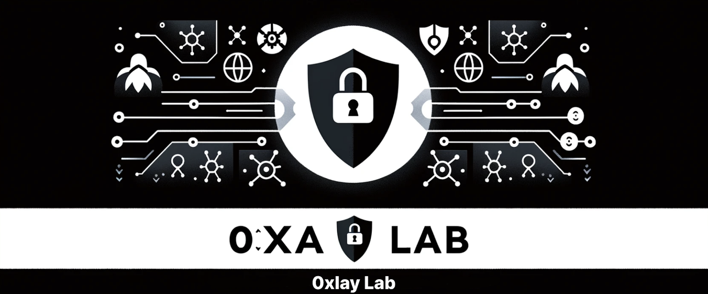

    

### Hi there 👋, I'm Serge (nickname: 0xlay)

### I'm 👨‍💻Software Engineer & 🕵️‍Security Researcher

### I like to make software. I'm interesting:
- 👨‍💻 System Development
- 🕵️‍♂️ Cyber Security
- 🖥️ OS Development

### Follow Me

### Programming languages

### Tools

### Systems

### Statistics

    
    

