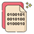
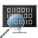

### Hi there 👋, I'm Serge (nickname: 0xlay)

### I'm a 🪟Windows System Developer & 🕵️‍Security Researcher

### I like to make software. I'm interesting:
- 👨‍💻 System Development
- 🕵️‍♂️ Cyber Security
- 🖥️ OS Development

### Follow Me

### Programming languages
)

)
)

### APIs and SDKs

### Unit testing

### Version control and build systems

### Tools

### Statistics

